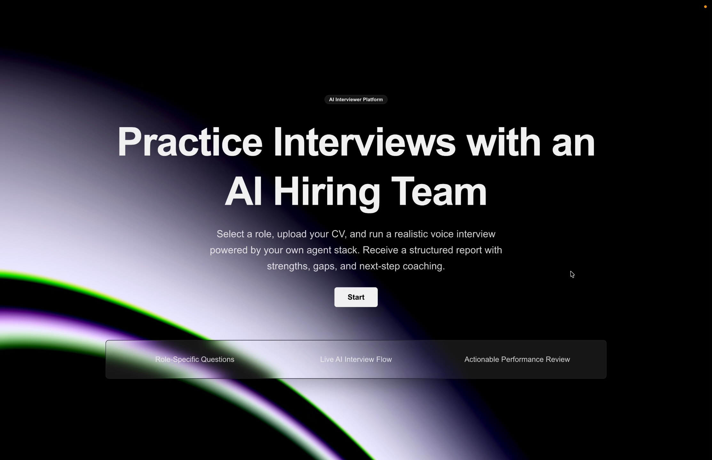
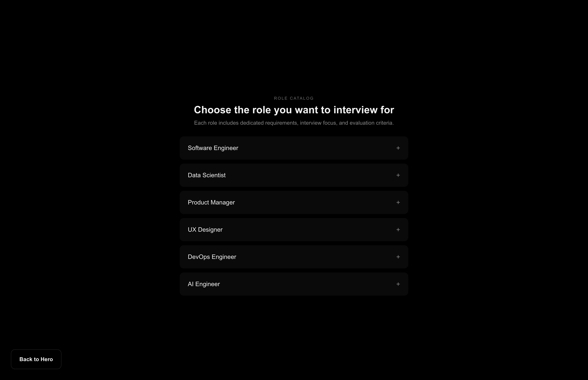
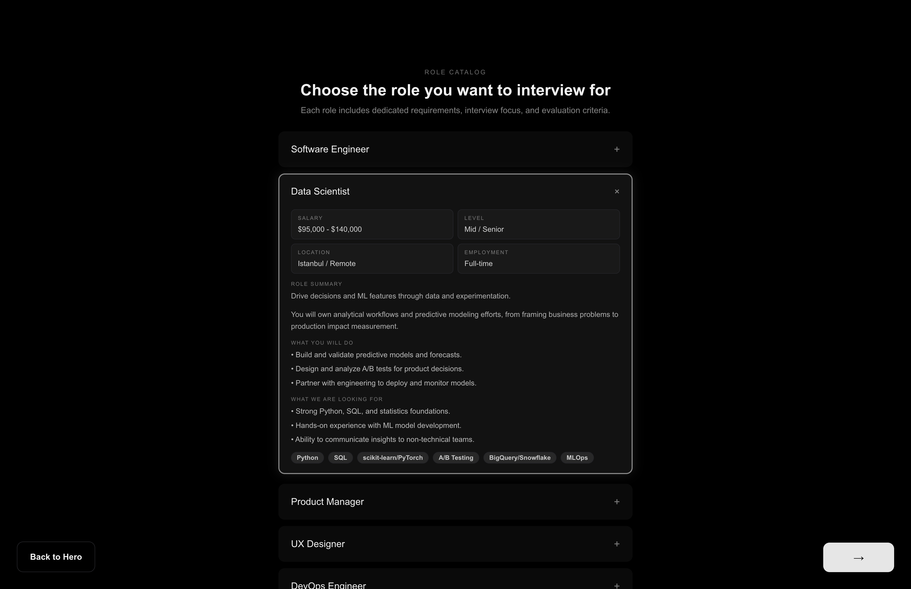
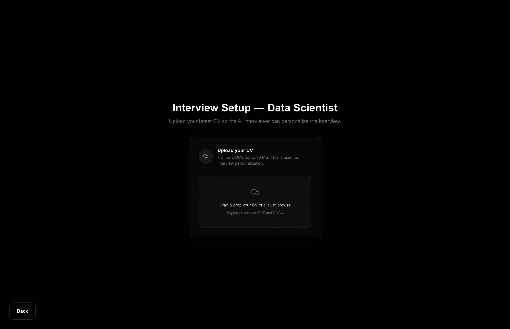
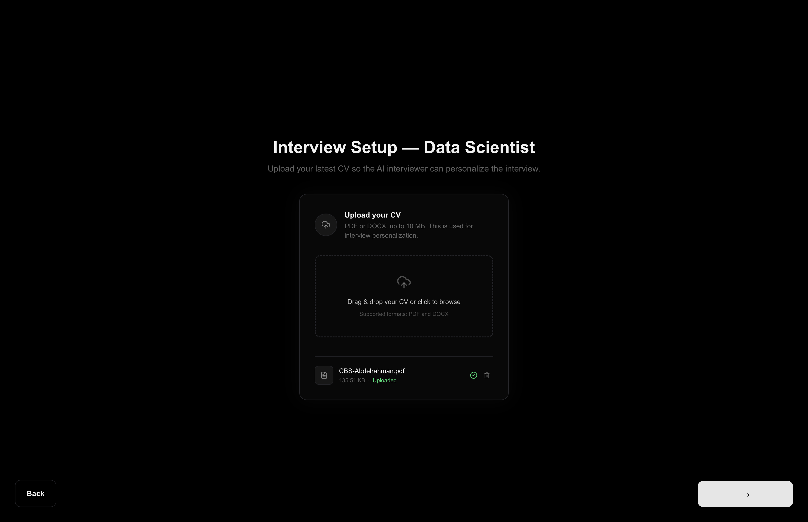
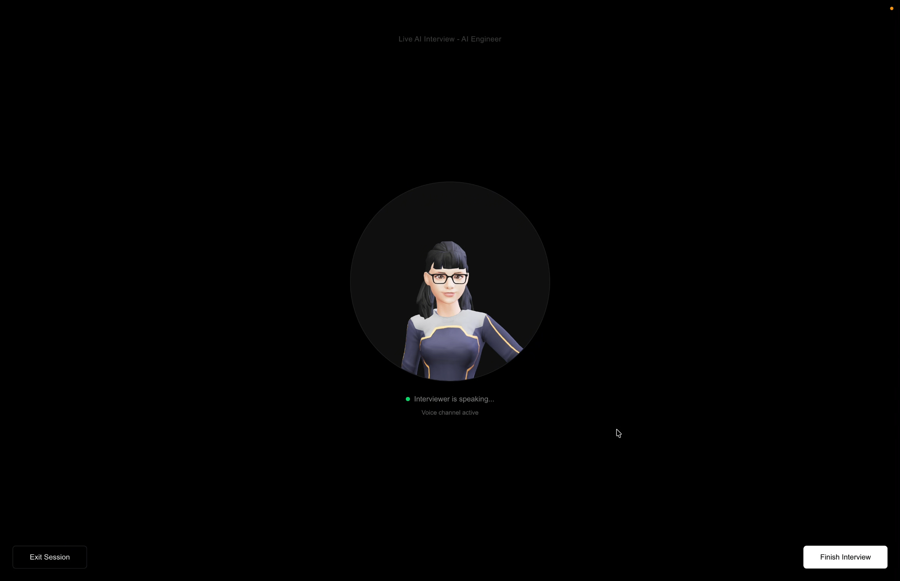
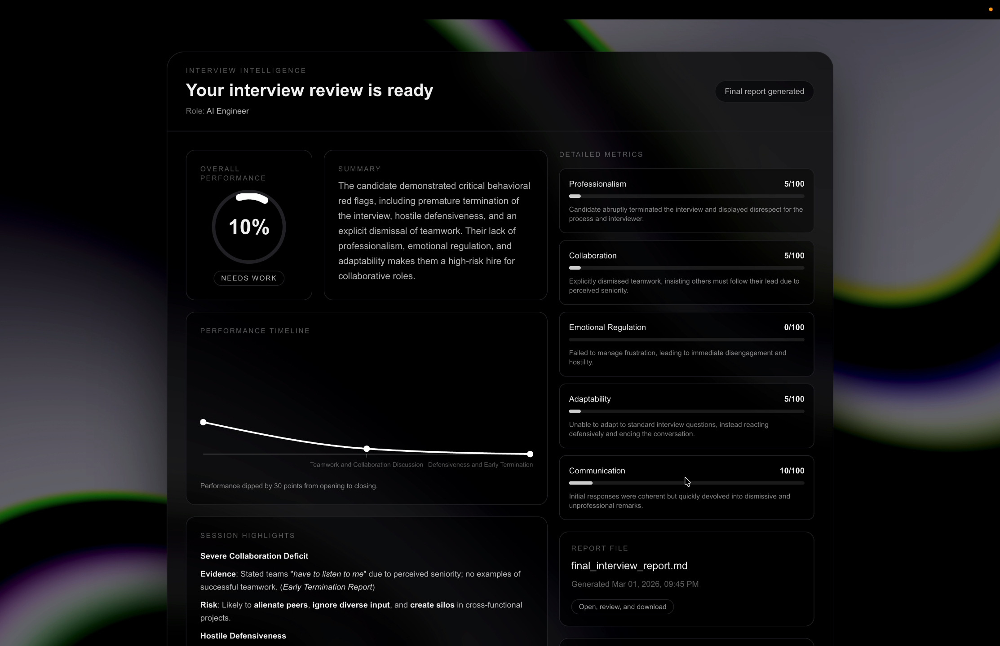
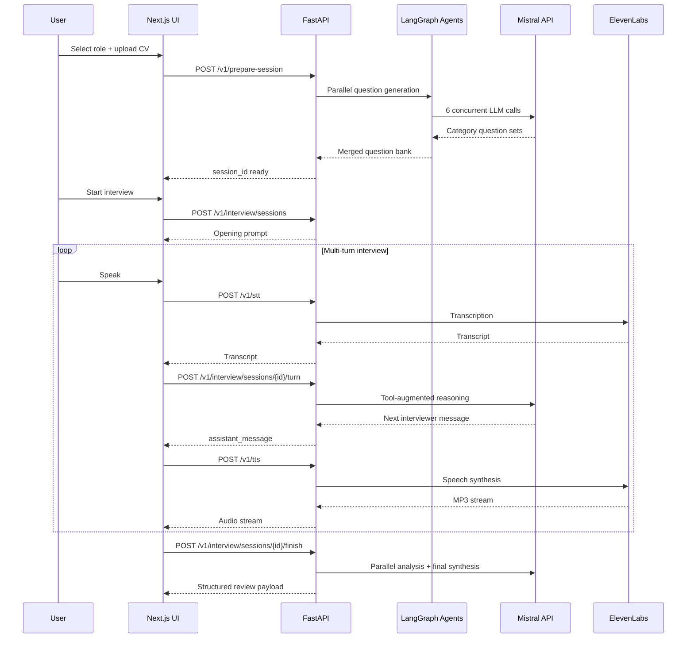
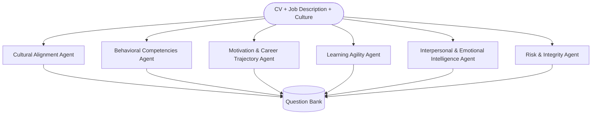

<div align="center">
  

  <h1>AI Interview Simulator: An Agentic, Avatar-Driven Mock Interview Platform</h1>

  <p>
    Zephlen's AI Interview Simulator is an autonomous, agentic interview-training platform built for Mistral Worldwide Hacks.
  </p>
  <p>
    It combines Mistral-powered multi-agent reasoning with ElevenLabs voice interaction to deliver realistic, adaptive mock interviews and structured performance feedback.
  </p>

  <p>
    <a href="https://www.youtube.com/@ZephlenAI"></a>
    <a href="https://www.linkedin.com/company/zephlen/"></a>
    <a href="https://www.instagram.com/zephlen.ai/"></a>
    
    
    
  </p>

  <p>
    <a href="#demo"><strong>Demo</strong></a> ·
    <a href="#getting-started"><strong>Quickstart</strong></a> ·
    <a href="#how-the-system-works"><strong>Architecture</strong></a> ·
    <a href="#api-reference"><strong>API</strong></a> ·
    <a href="#contributors"><strong>Contributors</strong></a>
  </p>
</div>

Last reviewed: March 2, 2026

## Table of Contents

- [Demo](#demo)
- [Screenshots (Live App)](#screenshots-live-app)
- [Key Features](#key-features)
- [Tech Stack](#tech-stack)
- [Prerequisites](#prerequisites)
- [Getting Started](#getting-started)
- [Verify Setup](#verify-setup)
- [How the System Works](#how-the-system-works)
- [Architecture Deep Dive](#architecture-deep-dive)
- [Environment Variables](#environment-variables)
- [API Reference](#api-reference)
- [API Conventions and Error Handling](#api-conventions-and-error-handling)
- [Available Commands](#available-commands)
- [Testing](#testing)
- [Troubleshooting](#troubleshooting)
- [Repository Layout](#repository-layout)
- [Contributing](#contributing)
- [License](#license)
- [Contributors](#contributors)

## Demo

[](https://youtu.be/47VHrI7td7A?si=Id51xJcEdnSDo4Ml)

## Screenshots (Live App)

<table>
  <tr>
    <td><strong>Landing</strong><br/></td>
    <td><strong>Jobs</strong><br/></td>
  </tr>
  <tr>
    <td><strong>Job Details</strong><br/></td>
    <td><strong>Upload CV</strong><br/></td>
  </tr>
  <tr>
    <td><strong>CV Uploaded</strong><br/></td>
    <td><strong>Live Avatar Interview</strong><br/></td>
  </tr>
  <tr>
    <td colspan="2"><strong>Performance Dashboard</strong><br/></td>
  </tr>
</table>

## Key Features

- Multi-agent question generation across six HR dimensions (parallel fan-out/fan-in).
- Adaptive, tool-augmented interviewer agent that avoids repeated questions.
- Voice interview loop with STT (speech-to-text), TTS (text-to-speech), and animated avatar output.
- Session-scoped outputs for interview logs, category analysis, and final report synthesis.
- Post-interview dashboard with category scoring and improvement recommendations.
- Simulation scripts for automated interviewer quality monitoring.

## Tech Stack

- **Backend API**: FastAPI, Uvicorn, Pydantic
- **LLM Orchestration**: LangGraph, LangChain
- **LLM Provider**: Mistral AI API
- **Voice Layer**: ElevenLabs STT/TTS
- **Frontend**: Next.js, React, TypeScript, Tailwind CSS, Framer Motion
- **Utilities**: PyMuPDF (`fitz`) for CV text extraction, `httpx` for provider calls

## Prerequisites

- Python 3.11+ (3.13 tested)
- Node.js 20+
- npm 10+
- Mistral API key
- ElevenLabs API key
- Microphone access in browser for voice interview flow

Optional but useful:

- `pytest` for test execution
- Qdrant running locally/remotely if you use Qdrant-specific smoke tests

## Getting Started

### 1. Clone the Repository

```bash
git clone <your-repo-url>
cd Mistral-Hackathon
```

### 2. Backend Setup

#### macOS/Linux

```bash
python3 -m venv .venv
source .venv/bin/activate
pip install -r requirements.txt
cp .env.example .env
```

Update root `.env` with your real values:

```env
MISTRAL_API_KEY=your_mistral_key
ELEVENLABS_API_KEY=your_elevenlabs_key
ELEVENLABS_VOICE_ID=your_voice_id
INTERVIEW_API_HOST=0.0.0.0
INTERVIEW_API_PORT=8081
```

Run backend:

```bash
python -m hackathon.api.server
```

#### Windows (PowerShell)

```powershell
py -3 -m venv .venv
.\.venv\Scripts\Activate.ps1
pip install -r requirements.txt
Copy-Item .env.example .env
```

Update root `.env` with your real values:

```powershell
@"
MISTRAL_API_KEY=your_mistral_key
ELEVENLABS_API_KEY=your_elevenlabs_key
ELEVENLABS_VOICE_ID=your_voice_id
INTERVIEW_API_HOST=0.0.0.0
INTERVIEW_API_PORT=8081
"@ | Set-Content .env
```

Run backend:

```powershell
python -m hackathon.api.server
```

### 3. Frontend Setup

Open a second terminal:

#### macOS/Linux

```bash
cd ui
npm install
printf "INTERVIEW_AGENT_API_URL=http://localhost:8081\n" > .env.local
npm run dev
```

#### Windows (PowerShell)

```powershell
cd ui
npm install
"INTERVIEW_AGENT_API_URL=http://localhost:8081" | Set-Content .env.local
npm run dev
```

### 4. Open the App

- Frontend: `http://localhost:3000`
- Backend health endpoint: `http://localhost:8081/health`

## Verify Setup

### Backend health check

```bash
curl http://localhost:8081/health
```

Expected output:

```json
{"status":"ok"}
```

### Frontend functional check

1. Open `http://localhost:3000`
2. Select a job role
3. Upload a CV
4. Confirm the app progresses into analysis/interview flow

### Expected output artifacts

After running an interview, expect generated files under:

- `outputs/sessions/<session_id>/...`
- `outputs/sessions/<session_id>/reports/...`

## How the System Works



## Architecture Deep Dive

### 1. Multi-Agent Question Generation

The system runs six domain-specific agents in parallel:

- Cultural Alignment
- Behavioral Competencies
- Motivation & Career Trajectory
- Learning Agility
- Interpersonal & Emotional Intelligence
- Risk & Integrity



### 2. Interview Runtime Agent

The interviewer agent runs as a tool-augmented LLM loop. It can:

- Read CV/JD/context sources
- Access generated category questions
- Track asked questions
- Log Q&A segments
- Decide when interview coverage is sufficient to finish

### 3. Reporting Pipeline

After interview completion:

1. Category-level analyses run concurrently.
2. A final synthesis composes an aggregated report.
3. Review payload is returned to frontend for dashboard rendering.

### 4. Voice Layer

Current UI flow uses HTTP endpoints for voice (`/v1/stt`, `/v1/tts`).

- `/v1/stt/realtime` WebSocket endpoint exists in backend.
- It is optional and not required by the current UI path.

## Environment Variables

The backend loads environment variables from root `.env` via `pydantic-settings`.

### Required

| Variable | Description |
|---|---|
| `MISTRAL_API_KEY` | API key for all Mistral model operations |
| `ELEVENLABS_API_KEY` | API key for STT and TTS |

### Recommended

| Variable | Default | Description |
|---|---|---|
| `ELEVENLABS_VOICE_ID` | `OYTbf65OHHFELVut7v2H` | Voice profile for synthesized interviewer audio |
| `INTERVIEW_API_HOST` | `0.0.0.0` | Backend bind host |
| `INTERVIEW_API_PORT` | `8081` | Backend bind port |
| `INTERVIEW_API_CORS_ORIGINS` | `*` | Allowed CORS origins (comma-separated for multiple) |
| `LOG_LEVEL` | `INFO` | Backend log verbosity |
| `ENVIRONMENT` | `development` | Runtime environment label |

### Optional advanced settings

| Variable | Default | Purpose |
|---|---|---|
| `QDRANT_API_URL` / `QDRANT_URL` | `http://localhost:6333` | Qdrant endpoint |
| `QDRANT_API_KEY` | `""` | Qdrant auth key |
| `QDRANT_COLLECTION` | `company_info` | Collection name |
| `HR_ANALYSIS_CONCURRENCY` | `4` | Parallelism for report generation |
| `LLM_MAX_RETRIES` | `6` | Retry budget for LLM calls |
| `LLM_RETRY_BASE_DELAY_SECONDS` | `1.0` | Retry base delay |
| `LLM_RETRY_MAX_DELAY_SECONDS` | `20.0` | Retry max delay |

## API Reference

| Method | Endpoint | Description |
|---|---|---|
| `GET` | `/health` | Backend health check |
| `POST` | `/v1/prepare-session` | Upload CV, generate question bank, return `session_id` |
| `POST` | `/v1/interview/sessions` | Start interview session |
| `GET` | `/v1/interview/sessions/{id}` | Session metadata/status |
| `POST` | `/v1/interview/sessions/{id}/turn` | Submit candidate turn and get assistant reply |
| `POST` | `/v1/interview/sessions/{id}/finish` | Finish interview and trigger report generation |
| `GET` | `/v1/interview/sessions/{id}/report` | Fetch review payload |
| `POST` | `/v1/stt` | Speech-to-text for uploaded audio |
| `POST` | `/v1/tts` | Text-to-speech streaming response |
| `WS` | `/v1/stt/realtime` | Optional realtime STT WebSocket endpoint |

## API Conventions and Error Handling

- Endpoints are versioned under `/v1/...`.
- Non-file routes are JSON-based.
- Session-related not-found errors return `404` with `session_not_found`.
- Provider/configuration issues may return `503` (for example missing API key).
- Operation failures typically return `500` with operation-specific detail strings like:
  - `turn_failed`
  - `finish_failed`
  - `report_failed`

## Available Commands

### Backend commands

| Command | Purpose |
|---|---|
| `python -m hackathon.api.server` | Run FastAPI backend |
| `python hackathon/core/agents/conduct_interview.py` | Run terminal interview mode |
| `python hackathon/core/agents/simulate_interview.py` | Run simulation scenarios |
| `python hackathon/core/agents/monitor_simulations.py` | Summarize simulation monitor output |
| `python hackathon/tests/test_mistral_factory.py` | Mistral model/factory smoke test |
| `python hackathon/tests/test_qdrant_connection.py` | Qdrant connectivity smoke test |
| `python sync_requirements.py --output /tmp/requirements.synced.txt` | Safely preview dependency sync |

### Frontend commands (`ui/`)

| Command | Purpose |
|---|---|
| `npm run dev` | Start local development server |
| `npm run build` | Build production bundle |
| `npm run start` | Start production Next.js server |
| `npm run lint` | Run ESLint checks |

## Testing

### Quick smoke checks

```bash
# Backend health
curl http://localhost:8081/health

# Frontend lint/build
cd ui
npm run lint
npm run build
```

### Python test utilities

```bash
# Mistral factory smoke test
python hackathon/tests/test_mistral_factory.py

# Qdrant connection smoke test (requires qdrant-client and configured service)
python hackathon/tests/test_qdrant_connection.py
```

### Pytest suite

If `pytest` is installed in your environment:

```bash
python -m pytest hackathon/tests
```

## Troubleshooting

### Backend starts but UI cannot connect

- Confirm `ui/.env.local` contains `INTERVIEW_AGENT_API_URL=http://localhost:8081`.
- Confirm backend health: `curl http://localhost:8081/health`.

### STT/TTS failures

- Verify `ELEVENLABS_API_KEY` is configured.
- Verify outbound network access to ElevenLabs APIs.

### LLM call failures

- Verify `MISTRAL_API_KEY` is configured.
- Check retry settings (`LLM_MAX_RETRIES` and delay vars).

### CV extraction issues

- Ensure uploaded file is a readable PDF/text source.
- If extraction/import issues occur around `fitz`, install `pymupdf` in your environment.

### Microphone not working

- Grant browser microphone permissions.
- Verify correct input device at OS/browser level.

### Windows PowerShell activation blocked

```powershell
Set-ExecutionPolicy -ExecutionPolicy RemoteSigned -Scope CurrentUser
```

## Repository Layout

```text
.
├── hackathon/                  # Backend API, agents, prompts, tests
│   ├── api/
│   ├── config/
│   ├── core/
│   │   ├── agents/
│   │   ├── prompts/
│   │   └── tools/
│   ├── llm/
│   └── tests/
├── shared/                     # Shared utility modules
├── ui/                         # Next.js frontend
├── data/                       # Sample CV/JD/culture data
├── outputs/                    # Generated runtime artifacts (git-ignored)
├── assets/                     # README screenshots
├── sync_requirements.py        # Requirements sync helper
├── requirements.txt
└── LICENSE
```

## Contributing

1. Branch from `main`.
2. Keep changes scoped and commit messages clear.
3. Verify backend + frontend run locally.
4. Include screenshots for UI changes and testing notes in your PR.

## License

Licensed under the Apache License, Version 2.0. See [LICENSE](LICENSE).

## Contributors

<table>
  <tr>
    <td align="center" width="50%">
      <br/><br/>
      <strong><a href="https://www.linkedin.com/in/ifurkanatasoy/">İsmail Furkan Atasoy</a></strong><br/>
      <sub>Contributor</sub><br/><br/>
      <a href="https://www.linkedin.com/in/ifurkanatasoy/">
        
      </a>
      <a href="https://github.com/ifurkanatasoy">
        
      </a>
      <a href="https://www.instagram.com/ifurkanatasoy/">
        
      </a>
    </td>
    <td align="center" width="50%">
      <br/><br/>
      <strong><a href="https://www.linkedin.com/in/abdelrahman-wahdan">Abdelrahman Wahdan</a></strong><br/>
      <sub>Contributor</sub><br/><br/>
      <a href="https://www.linkedin.com/in/abdelrahman-wahdan">
        
      </a>
      <a href="https://github.com/Abdurrahman-Wahdan">
        
      </a>
      <a href="https://www.instagram.com/boodywahdan_/">
        
      </a>
    </td>
  </tr>
</table>

---

<div align="center">
  <table>
    <tr>
      <td valign="middle"><sub>Built for Mistral Worldwide Hacks</sub></td>
      <td valign="middle">&nbsp;&nbsp;</td>
    </tr>
  </table>
</div>
