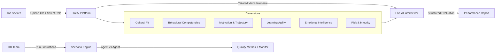
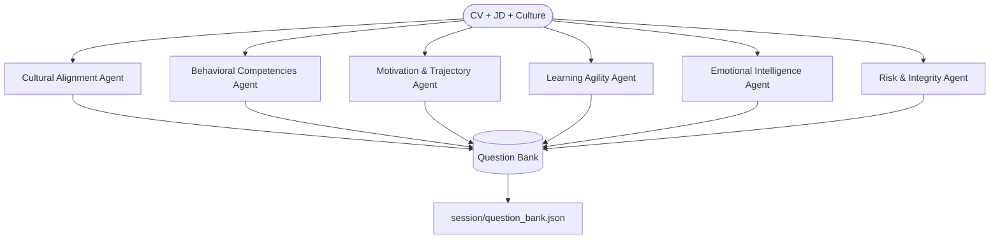
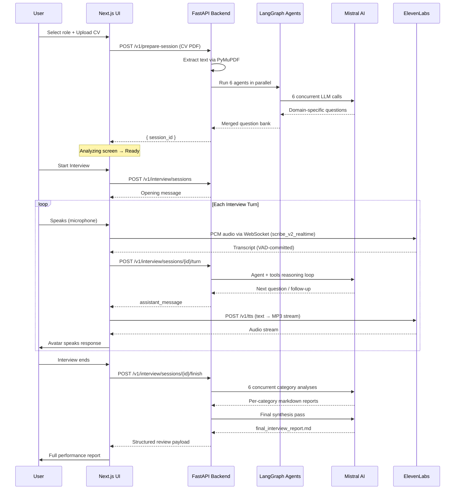

# HireAI — Autonomous AI Interview Platform

> Upload a CV. Select a role. Speak naturally. Receive a structured performance report.
> Powered entirely by Mistral AI, LangGraph, and ElevenLabs.

---

## What We Built

HireAI is a full-stack, voice-first AI platform that automates the complete HR interview lifecycle. It doesn't just ask pre-written questions — it reads your CV, understands the job description, generates a tailored question bank across six psychological dimensions, conducts a live voice conversation, logs every answer, and synthesizes a structured evaluation report. Everything from ingestion to final report is driven by Mistral models orchestrated through a multi-agent LangGraph pipeline.

---

## Use Cases



---

## AI Architecture

The platform is built around three sequential AI stages, each powered by Mistral models through LangChain and orchestrated by LangGraph.

### Stage 1 — Parallel Question Generation (LangGraph Fan-Out)

When a CV is uploaded, six specialized agents are spawned **concurrently** in a LangGraph `StateGraph`. Each agent receives the candidate's CV, the job description, and the company culture document, and independently generates three targeted questions for its domain. Results are merged back into a shared state via an `operator.ior` reducer — true fan-out/fan-in parallelism.



Each agent is a purpose-built Mistral instance with a domain-specific system prompt. Output is normalized, JSON-validated, and persisted to a session-scoped directory before the interview begins.

### Stage 2 — Tool-Augmented Interview Agent

The live interviewer is a Mistral model bound to five custom LangChain tools:

| Tool | Purpose |
|---|---|
| `read_document` | Reads the candidate CV, JD, or culture file |
| `list_categories` | Lists available question category files |
| `read_questions` | Fetches questions from a given category |
| `get_asked_questions` | Returns all questions already asked (prevents repetition) |
| `log_qa` | Persists the full Q&A conversation segment to disk |

The agent autonomously decides which questions to ask, follows up on candidate answers, detects evasion, and enforces a minimum coverage gate — it cannot conclude the interview until at least three distinct questions have been logged across different categories.

### Stage 3 — Concurrent Analysis & Report Synthesis

After the interview, each Q&A log file is analyzed in parallel using `asyncio.gather` and a configurable concurrency semaphore. Each category produces an independent markdown analysis. A final synthesis pass aggregates all six reports into a unified candidate evaluation document.

---

## Full Request Flow — UI to Final Report



---

## Tech Stack

### AI & Orchestration
- **Mistral AI** — All LLM inference (question generation, interview conduct, analysis, synthesis). Strictly Mistral-family models enforced at the factory layer.
- **LangGraph** — Stateful multi-agent orchestration. Fan-out parallel execution for question generation, state merging via `operator.ior`.
- **LangChain** — Tool binding, message formatting, retry logic with exponential backoff.

### Voice Pipeline
- **ElevenLabs Scribe v2 Realtime** — Low-latency streaming Speech-to-Text via WebSocket with VAD (Voice Activity Detection) and configurable silence threshold.
- **ElevenLabs Scribe v1** — Batch STT fallback for uploaded audio.
- **ElevenLabs TTS (eleven_multilingual_v2)** — Streaming text-to-speech, MP3 at 44.1 kHz/128kbps, played through an animated talking avatar.
- **Echo Filtering** — Custom `SequenceMatcher`-based echo guard prevents TTS audio from being re-ingested by the STT pipeline. Barge-in detection interrupts playback when the user speaks.

### Backend
- **FastAPI** — Async HTTP API with WebSocket support.
- **PyMuPDF (fitz)** — PDF text extraction for CV ingestion.
- **asyncio / Semaphore** — Controlled concurrency for parallel report generation.
- **Pydantic + pydantic-settings** — Request validation and typed configuration.

### Frontend
- **Next.js 15** (App Router) — Server-side routing and API proxy layer.
- **TypeScript** — End-to-end type safety.
- **Framer Motion** — Screen transition animations and talking avatar states.
- **TailwindCSS** — Utility-first styling.
- **Web Audio API** — Raw PCM capture, Int16 volume gating, VAD implemented in-browser.

### Infrastructure
- **Qdrant** — Vector store (available for semantic retrieval extensions).
- **sentence-transformers** — Embedding pipeline.
- **Uvicorn** — ASGI server.

---

## Key AI Design Decisions

**Why parallel agents for question generation?**
Each psychological dimension requires a different reasoning lens. Running them sequentially forces unnecessary serialization and leaks framing from one domain into another. Parallel execution with independent system prompts guarantees domain purity and cuts preparation time by ~6×.

**Why tool-calling for the interviewer instead of a fixed script?**
A scripted interviewer can't adapt. The tool-calling agent reads the candidate's actual CV at runtime, selects questions that are genuinely relevant to their background, avoids repetition by querying its own logs, and follows up on evasive or incomplete answers. The structured JSON output contract (`message_to_candidate` + `end_interview`) gives the frontend a clean integration surface without hallucination leakage.

**Why a two-pass reporting architecture?**
Category-level analysis preserves the nuance of each dimension — behavioral competencies require different evaluation criteria than risk assessment. The final synthesis pass then reasons holistically across all six reports, producing a coherent narrative rather than a concatenation of scores.

**Why ElevenLabs VAD over client-side silence detection?**
Server-side VAD via `scribe_v2_realtime` with `CommitStrategy.VAD` and a 450ms silence threshold produces dramatically cleaner transcription boundaries compared to client-side amplitude heuristics. The echo guard (both string containment and Levenshtein ratio) handles the edge case where TTS audio bleeds into the microphone during playback.

---

## Simulation & Testing

The platform ships with an autonomous agent-vs-agent simulation engine. A dedicated candidate LLM (with configurable behavioral scenarios) is paired against the interviewer agent, producing full transcripts, quality scores, and monitor logs without any human involvement.

Built-in scenarios include: cooperative, rude, evasive, off-topic, silent, and contradictory candidates. The quality scorer penalizes repeated questions, unprofessional language, technical drift, and early termination — providing a continuous regression harness for interviewer agent improvements.

---

## Quickstart

```bash
# Backend
pip install -r requirements.txt
python -m hackathon.api.server        # binds to 0.0.0.0:8081

# Frontend
cd ui
echo "INTERVIEW_AGENT_API_URL=http://localhost:8081" > .env.local
npm install && npm run dev
```

Required environment variables:
```
MISTRAL_API_KEY=...
ELEVENLABS_API_KEY=...
ELEVENLABS_VOICE_ID=...
```

---

## API Reference

| Method | Endpoint | Description |
|---|---|---|
| `POST` | `/v1/prepare-session` | Upload CV PDF, generate question bank, return session_id |
| `POST` | `/v1/interview/sessions` | Initialize interview session |
| `POST` | `/v1/interview/sessions/{id}/turn` | Submit candidate message, receive agent response |
| `POST` | `/v1/interview/sessions/{id}/finish` | End interview and trigger report generation |
| `GET` | `/v1/interview/sessions/{id}/report` | Fetch final evaluation report |
| `POST` | `/v1/stt` | Batch speech-to-text (file upload) |
| `POST` | `/v1/tts` | Text-to-speech (streaming MP3) |
| `WS` | `/v1/stt/realtime` | Real-time STT WebSocket with echo filtering |

---

*Built for the Mistral AI Hackathon.*
